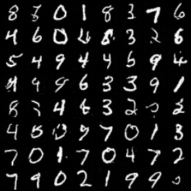

# Diffusion Models with SDEs

This is an attempt to implement diffusion based generative models (Score-based models, DDPMs) using Stochastic Differential Equations from the paper [Score-Based Generative Modeling through Stochastic Differential Equations](https://arxiv.org/abs/2011.13456)

## What is in here? 
* Variance Preserving SDE 
* Probability Flow sampling 
* MNIST, CIFAR 10, 100 with a simple UNet model as score function (time dependence is not yet implemented) 

## Training
```
python main.py --c 'configs/vpsde_mnist.yaml'
```

## Next steps..
* Implement Variance Exploding SDE, Sub-VPSDE
* Implement sampling by solving reverse SDE
* Maximum likelihood based training using likelihood weighting (from [this](https://arxiv.org/abs/2101.09258) paper) 

## Samples 
* Disclaimer -- Model not trained till convergence (better ones along with fancy animation on the way)

    